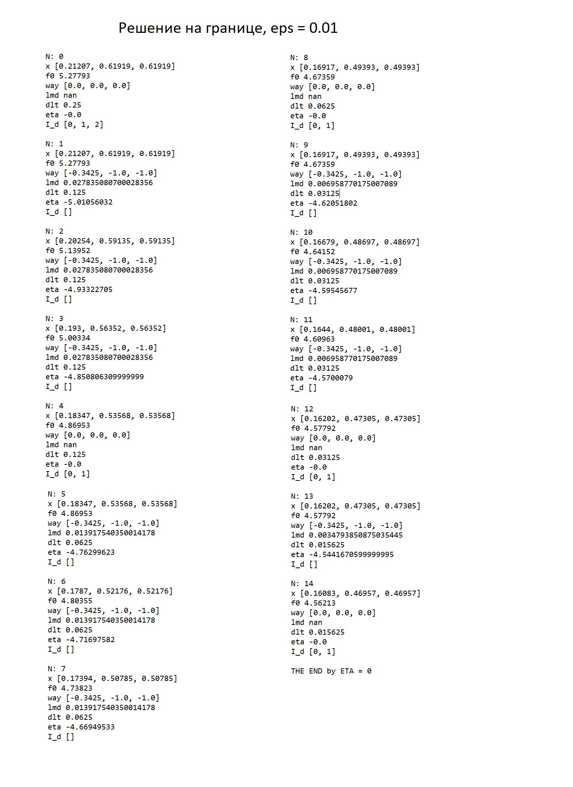
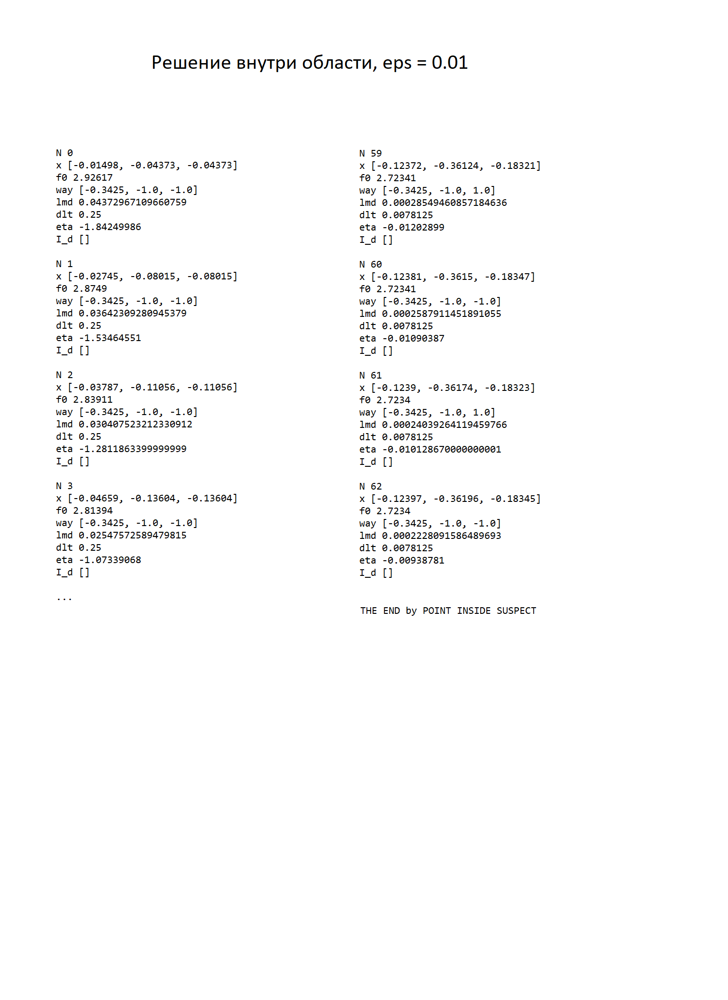
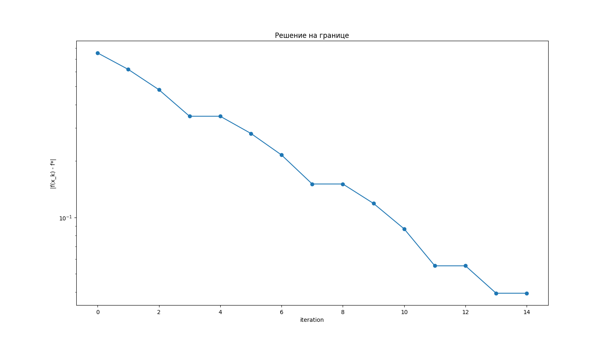
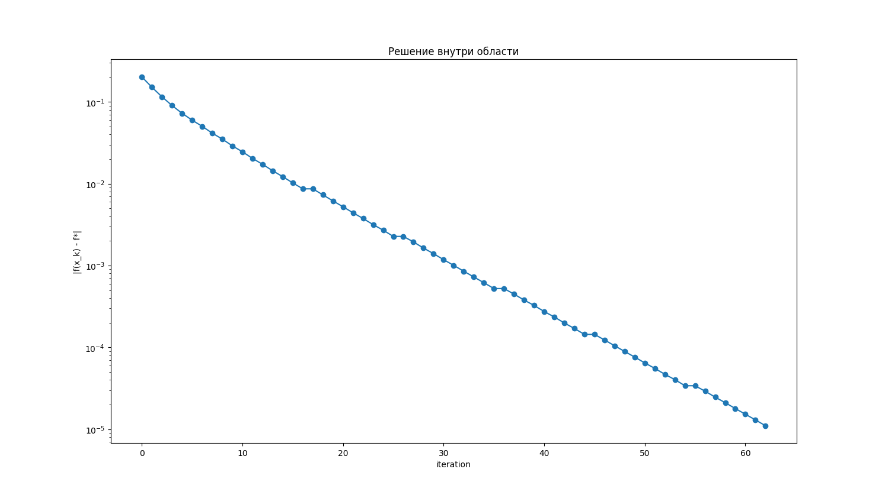

## Solving multi-dimensional minimization problems with restrictions
- [Solving multi-dimensional minimization problems with restrictions](#solving-multi-dimensional-minimization-problems-with-restrictions)
  - [Description](#description)
  - [Get started](#get-started)
  - [Project structure](#project-structure)
  - [Results](#results)


### Description
The problem of three-dimensional minimization is given

$\varphi_0(x)=x_0 + x_1 + 0.5x_2 + 3\sqrt{1 + 3x_0^2 + x_1^2 + x_2^2}$

It is necessary to fulfill three nonlinear conditions - inequalities and one linear condition - equality. Two blocks of conditions are given: in the first block, the solution of the problem is inside the permissible area; in the second block, on its border. 

Block 1:
$
\left\{
\begin{array}{ll}
x_0^2 + x_1^2 - 1 \leq 0\\
x_0^2 + x_2^2 - 1 \leq 0\\
x_1^2 + x_2^2 - 1 \leq 0\\
x_1 - \frac{0.35426}{0.121334} x_0 = 0\\
\end{array}
\right.
$

Block 2:
$
\left\{
\begin{array}{ll}
(x_0 - 1)^2 + (x_1 - 1)^2 - 1 \leq 0\\
(x_0 - 1)^2 + (x_2 - 1)^2 - 1 \leq 0\\
x_1^2 + x_2^2 - 1 \leq 0\\
x_1 - \frac{0.35426}{0.121334} x_0 = 0\\
\end{array}
\right.
$

It is necessary to solve the problem of conditional minimization by the method of all possible directions of Zoitendijk

### Get started
```bash
git clone https://github.com/IMZolin/multi-dimension-minimization-restrictions <your project name>
cd <your project name>
pip install -r requirements.txt
```

### Project structure
```bash
├───graphics            
├───report
│   └───lab3_opt_methods.pdf 
├───src                 # code
│   ├───golden_egg.py      # Golden Ratio Method
│   ├───main.py  # corner dots 
│   ├───One_D_Problem_file.py # one dimension minimization problem class
│   ├───result_analisys.py  # get results
│   ├───test_uniform.py # test code for running uniform search method
│   ├───result_analisys.py # get results
│   ├───Trial_Point_Method_file.py # Trial Point Method
└───────uniform_search.py # Uniform Search Method
```

### Results

1. Solution on the border

2. Solution inside the area

3. Graphics of solution on the border

4. Graphics of solution inside the area

